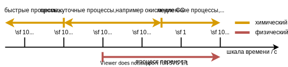

#  Физические и химические процессы

## Что такое пожар?

В общих чертах: пожар - это экзотермическая химическая реакция.

**Техническое горение – Желаемые пожары**

:::{figure-md} fig-wanted-fire

В газовой плите для получения тепла используется горючий газ. Благодаря геометрии и свойствам потока газа плита обеспечивает управляемое пламя. Источник: [Wikimedia Commons](https://commons.wikimedia.org/wiki/File:Gas_flame.jpg).
:::

*Желаемые пожары*, то есть технические процессы горения, являются **контролируемыми** процессами, используемыми, например, для обогрева или приведения в движение. Хотя термин *желаемый* пожар немного вводит в заблуждение, пожары, как правило, неожиданные и связанные с несчастными случаями, костер - одно из основных желаемых применений огня.

:::{figure-md} fig-bonfire

Разведение костров необходимо, например, для приготовления пищи.
:::

**Нежелательные пожары**

:::{figure-md} fig-unwanted-fire

Пожар в здании. Источник: [Wikimedia Commons](https://commons.wikimedia.org/wiki/File:Fire_inside_an_abandoned_convent_in_Massueville,_Quebec,_Canada.jpg).
:::

Нежелательные пожары - это **неконтролируемые и нежелательные** процессы. В основном это инциденты внутри зданий, которые представляют опасность для дикой природы, людей и имущества.

**Примеры пожаров**

* Костер
    * [Костер на берегу озера](https://youtu.be/NUKKzdVy0EI)
    * [Медленный разжигающий костер](https://uni-wuppertal.sciebo.de/s/e0c3Ut8OolZGTC8)
* Лесные пожары
    * [Хождение с огнем: документальный фильм о лесных пожарах](https://youtu.be/6y0__CZI-Cw)
    * [Торфяные пожары в Индонезии](https://youtu.be/2qYzTU0q9XE)
* Пожары в жилых помещениях
    * [Вспышка при пожаре в помещении](https://youtu.be/w4W82HIzUcc)
    * [Пожар на складе](https://youtu.be/xzuNVFn0U48)

## Обзор процессов

:::{figure-md} fig-fire-processes

Визуализация основных процессов, связанных с пожарами.
:::

Пожары представляют собой сложное взаимодействие множества физических и химических процессов. Хотя большинство из них протекает в газовой фазе, например горение, пожары обычно включают также процессы в твердой или жидкой фазе, например пиролиз, при котором образуется топливо для горения. Следующие процессы охватывают основные явления.

1. **Гидродинамика**
    * фундаментальный процесс переноса массы и импульса в газовой фазе
    * потоки, связанные с пожаром, в основном турбулентные
1. **Теплопередача**
    * теплый газ, например продукты сгорания, перемещается вверх за счет тепловой конвекции
    * горячее вещество испускает чистое тепловое излучение
    * теплопроводность внутри твердого тела
1. **Горение**
    * быстрое окисление топлива в пламени
    * высвобождение химической энергии, например, локально нагревающийся газ или тепловое излучение
1. **Пиролиз**
    * разрушение структуры твердого тела
    * выброс летучих газов, например, топлива для горения
    
## Гидродинамика

При пожаре выделяется тепло в газовой фазе, а плавучесть нагретого газа приводит к образованию дыма. Потоки в отсеках имеют сложную структуру и включают в себя множество отверстий в окружающую среду, а также препятствия, см. {numref}`fig-compartment-flow`. Механическая вентиляция, системы отопления, вентиляции и кондиционирования воздуха (HVAC), а также ветер могут быть включены в оценку динамики дыма.

:::{figure-md} fig-compartment-flow

Иллюстрация потенциального потока внутри здания, обусловленного выделением тепла при пожаре. Существует приток и отток, которые соединяют замкнутый поток с окружающей средой. 
:::

Большинство огненных потоков, особенно в области пламени и факела, являются турбулентными. Турбулентный процесс смешивания во время горения имеет решающее значение, и поступление свежего холодного воздуха в дым существенно определяет его динамику. Экспериментальный анализ, а также численные модели должны учитывать макроскопические эффекты турбулентности.

:::{figure-md} fig-turbulence-transition-candle

Переход от ламинарного течения к турбулентному в дыме горящей свечи. Изображение получено с помощью [фотографии шлирена](https://en.wikipedia.org/wiki/Schlieren_photography), которая визуализирует различия в показателе преломления. Источник: [Wikimedia Commons](https://commons.wikimedia.org/wiki/File:Laminar-turbulent_transition.jpg).
:::

## Реактивные потоки

Причиной возникновения пожаров является энергия, выделяемая при горении, которое является экзотермическим химическим процессом. В простейшем случае два вида газа, здесь кислород и топливо, вступают в реакцию и выделяют энергию. В реальных пожарах задействован целый зоопарк видов и реакций. В зависимости от концентрации отдельных видов и их локальных температур могут образовываться новые химические соединения. Таким образом, общий спектр продуктов, обусловленный химическими процессами во время пожара, редко бывает простым.

В отличие от технического горения, при пожарах кислород и топливо обычно не смешиваются. Переход от сжигания без предварительной смеси к сжиганию с предварительной смесью можно хорошо наблюдать с помощью горелки Бунзена, см. {numref}`fig-bunsen-burner`.  

:::{figure-md} fig-bunsen-burner

Переменные концентрации кислорода в выходящем потоке горелки Бунзена. Слева направо: воздушный клапан закрыт, почти полностью закрыт, клапан полуоткрыт и максимально открыт. Источник: [Wikimedia Commons](https://commons.wikimedia.org/wiki/File:Bunsen_burner_flame_types.jpg).
:::

Временные рамки, в течение которых происходят химические реакции, охватывают несколько порядков величины, см. {numref}`fig-chem-time-scales`. Типичные процессы горения протекают намного быстрее, чем обычные процессы переноса массы при пожарах.

:::{figure-md} fig-chem-time-scales

Рис. 1.8 (ОЧЕНЬ) Приблизительные временные рамки химических и физических процессов в реактивных потоках. 
:::

## Теплопередача

Тепло может передаваться между помещениями и материалами различными способами. Поток тепла обусловлен различиями в температуре. Существует три режима передачи тепла, где фундаментальными являются только проводимость и излучение и не требуют наличия теплоносителя в гравитационном поле.

Режимы теплопередачи следующие:
* **Конвекция (Convection):** перенос вещества с различными температурами за счет индуцированных плавающих потоков 
* **Проводимость (Conduction):** диффузия тепла в материале
* **Излучение (Radiation):** излучение и поглощение электромагнитных волн

:::{figure-md} fig-heat-transfer-overview

Схематическая иллюстрация различных режимов теплопередачи. Источник: [Wikimedia Commons](https://commons.wikimedia.org/wiki/File:Heat-transmittance-means2.jpg).
:::

Все три режима важны при пожарах. Выделяющаяся химическая энергия при горении локально нагревает газ, который изменяет свою плотность и, таким образом, влияет на плавучесть. Помимо локального нагрева, горячий газ испускает тепловое излучение во всех направлениях. Таким образом, в случае пожара в помещении тепло передается к стенам или другим конструкциям и, например, к твердому веществу, которое служит источником топлива для пожара. Таким образом, поверхность твердого тела нагревается, и теплопроводность распространяет поглощенную энергию по твердому телу.

## Пиролиз

Пиролиз описывает выделение (потенциально горючих) газов из твердого материала. В целом, это зависит от температуры твердого вещества, поскольку реакции разложения требуют энергии. Для жидкостей может происходить дополнительное испарение.

В случае горения древесины, например, спички на {numref}`fig-burning-match`, твердый материал сам по себе не участвует в горении, а обеспечивает только топливо для горения. Не все материалы газифицируются и образуют угольный остаткок.

:::{figure-md} fig-burning-match

Горящая спичка, где топливо для горения выделяется древесиной в результате пиролиза. Источник: [Wikimedia Commons](https://commons.wikimedia.org/wiki/File:Streichholz.JPG).
:::

