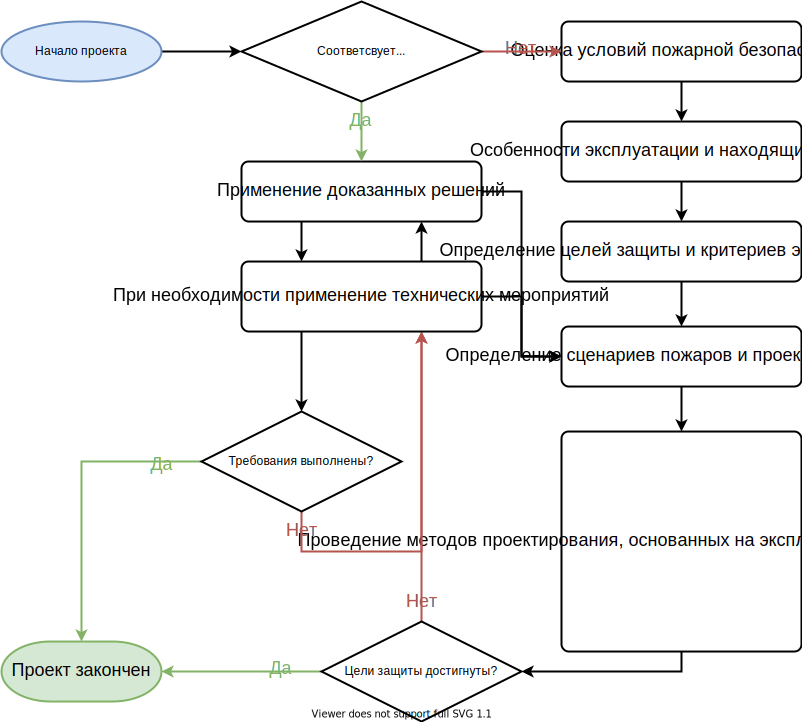
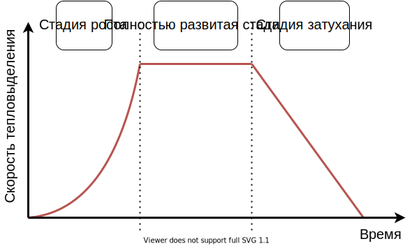

# 1.2. Инженерия пожарной безопасности

Моделирование пожаров является одним из аспектов широкого спектра инженерной деятельности в области пожарной безопасности (FSE). В то время как инженерные темы нацелены на практическое применение, модели пожаров используются для научных исследований в области пожарной безопасности (FSS).

Следующие разделы дают лишь очень краткое введение в широкие темы, рассматриваемые здесь. Отправные пункты для дальнейшего чтения в этой области приведены в {cite}`vfdb-leitfaden:2020`, {cite}`VDI-6019-1`, {cite}`VDI-6019-2` или, например, в главах 37, 38 и 39 {cite}`sfpe-handbook-5th`.

## Законодательство о пожарной безопасности

[Конституционный закон Германии (Grundgesetz)](https://en.wikipedia.org/wiki/Basic_Law_for_the_Federal_Republic_of_Germany) гласит, что

* каждый человек имеет право на жизнь и физическую неприкосновенность, а также
* собственность влечет за собой обязательства.

На основе этого основного закона в  [Типовом строительном кодексе (Musterbauordnung)](https://www.bauministerkonferenz.de/Dokumente/42323097.pdf) сформулированы четыре цели защиты, включая пожарную безопасность. Этот кодекс определен для каждой федеральной земли Германии как государственный индивидуальный строительный кодекс (Bauordnung). (Bauordnung). 

Целями защиты являются:
1. предотвращение возникновения пожара
1. предотвращение распространения тепла и дыма
1. обеспечение эвакуации и принятие спасательных мер
1. обеспечение эффективных мер пожаротушения

Они предназначены для применения на протяжении всего жизненного цикла здания, т.е. во время строительства, обслуживания, модификации и техобслуживания.

## Предписывающие проекты

При предписывающем проектировании меры пожарной безопасности выполняются на основе общих правил. Это приводит к таким преимуществам, как 

* правила и стандарты позволяют принимать *приемлемые* решения
* в основном это практически осуществимо и экономично
* проектирование пожарной безопасности может проводиться *высококвалифицированными* специалистами
* юридическая определенность

Однако этот подход к проектированию также имеет некоторые преимущества, такие как

* описательные проекты отличаются индивидуальностью и сложностью
* применение  *считающихся удовлетворяющими* стратегий может быть неуместным, неэкономичным или даже невозможным
* при определенных обстоятельствах несоответствия применимым нормам и стандартам неизбежны
* ограничения для международной гармонизации и стандартизации

Альтернативой предписывающим проектам является применение проектов, основанных на эксплуатационных характеристиках.

## Проекты, основанные на производительности

**Общий подход**

В отличие от статичных и общих правил регламента, проектирование, основанное на характеристиках, следует идее создания эквивалентного уровня безопасности путем достижения целей защиты. Этот процесс позволяет инженерам использовать несколько подходов, которые также включают моделирование пожара, для итеративного проектирования концепции безопасности. Принципиальная схема показана на {numref}`fig-performance-based-design`.

:::{figure-md} fig-performance-based-design



Рис. 1.11 Упрощенная технологическая схема проектирования, основанного на предписаниях и производительности :::

**Качественный анализ**

Цели защиты должны быть определены для выполнения в широком диапазоне возможных сценариев. Эти определения должны учитывать:
* различные конструкции
* различные виды применения
* физика и поведение жильцов

Объем качественного анализа охватывает следующие аспекты:
* концепция здания
  * фундаментальная конструкция
  * строительные материалы
  * разделение огня и дыма
  * топология и разделение путей эвакуации
* концепция использования 
  * пожарные нагрузки
  * жильцы
  * сценарии использования
* инфраструктура 
  * технические системы 
  * защитные меры противопожарной защиты
* сценарии возникновения пожара
  * места возникновения пожаров
  * возможности распространения пламени и дыма
  
  
**Количественный анализ**

Для количественного анализа используются модели или эмпирические данные для оценки:
* сценарии пожаров и проектные пожары
* эффекты пожара, распространение дыма и истощение
* строительные компоненты и несущая конструкция
* оценка технических и защитных мер
* безопасность жизнедеятельности при воздействии огня
* выход в случае чрезвычайной ситуации

## Сценарий пожара

Для оценки отдельного инцидента с пожаром должен быть определен четкий сценарий пожара. В целом необходимо учитывать:

* расположение очага пожара
* пожарная нагрузка 
* развитие пожара
* условия вентиляции
* влияние технических мер
* влияние мер пожаротушения

В сценарии пожара необходимо указать развитие пожара, особенно скорость, с которой он выделяет тепло. Общий подход заключается в определении скорости выделения тепла, зависящей от времени, $\mf HRR(t)$, которая основана на так называемом естественном пожаре. Кривая естественного пожара является эмпирическим приближением к реальным пожарам в жилых помещениях, см. {numref}`fig-natural-design-fire`, которая может быть представлена в трех фазах:

1. **Рост**: после воспламенения огонь увеличивает скорость выделения тепла, пока не достигнет очага возгорания. На этом этапе скорость выделения тепла подчиняется квадратичной функции, т.е.
  
    $$\mf HRR(t) = \alpha\cdot t^2\quad,$$
    где  $\mf \alpha$ коэффициент интенсивности пожара.
1. **Полностью разработано**: После вспышки в огне участвует весь материал, который способен гореть. На этом этапе скорость тепловыделения достигает максимального значения $\mf HRR_{max}$ and stays constant, i.e. 
  
    $$\mf HRR(t) = HRR_{max}\quad.$$
1. **Затухание**: Когда расходуется около 70% пожарной нагрузки, начинается фаза затухания. Во время этой фазы скорость тепловыделения линейно уменьшается и достигает нулевого значения в определенный момент времени $\mf t_{end}$, т. е. 
  
    $$\mf \frac{HRR(t)}{dt} = const \quad.$$
    
    
:::{figure-md} fig-natural-design-fire



Рис. 1.12 Кривая скорости тепловыделения, основанная на приближении естественного пожара.
:::

В следующих таблицах представлены выбранные значения пожарной нагрузки и коэффициента интенсивности пожара, см. {cite}`VDI-6019-1`. 


```{list-table} Коэффициенты интенсивности пожара
:header-rows: 1
:name: tab-alpha
:widths: auto
:align: right

* - Скорость развития пожара 
   - Коэффициент интенсивности пожара, <br>$\mf \alpha \ / \ kW/s^2$
* - медленно
   - 0.0029
* - Средний
   - 0.012
* - быстро   
   - 0.047
* - очень быстро
   - 0.188
```


```{list-table} Удельные максимальные скорости тепловыделения
:header-rows: 1
:name: tab-hrr-max
:widths: auto
:align: right

* - Здание или объект 
   - Удельная максимальная скорость тепловыделения, <br> $\mf HRR_{max}'' \ / \ kW/m^2$
   - Скорость развития пожара
* - Офисы
   - 300
   - Средний
* - гостиничные номера
   - 250
   - Средний
* - торговые площади
   - 500
   - быстро
* - выставки, театры, кинозалы, сцены
   - 500
   - быстро
* - резиденция
   - 500
   - Средний
* - музей
   - 300
   - slow
* - горящий полуприцеп
   - 400
   - fast
* - размер деревянных поддонов <br> : $\mf 1.2~m \times 1.2~m \times 0.14~m$,<br> влажность: от 6% до 12%, хранение штабелями / блоками, высота: <br> height: $\mf 0.5~m$
   - 1250
   - от среднего до быстрого
* - почтовые пакеты, высота хранения $\mf 1.5~m$
   - 400
   - быстро
```
