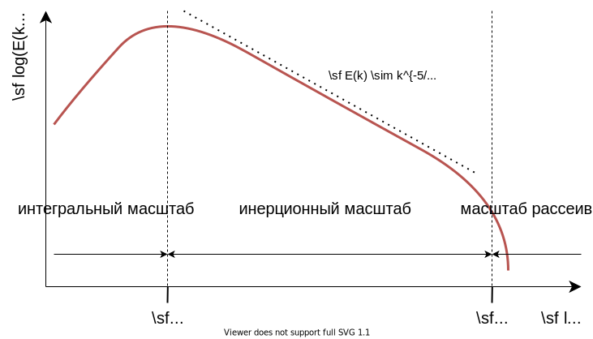

# Турбулентность

Турбулентность является одной из основных научных проблем. Математическое описание и экспериментальные данные, относящиеся к гидродинамике, известны и доступны уже более ста лет.

>“Турбулентность - важнейшая нерешенная проблема классической физики”.
— Ричард Фейнман

>”Когда я встречусь с Богом, я задам ему два вопроса: Почему теория относительности и почему турбулентность? Я действительно верю, что у него будет ответ на первый вопрос ”.
— Вернер Гейзенберг

Понимание природы турбулентности является одной из [проблем тысячелетия](https://www.claymath.org/millennium-problems/navier–stokes-equation).

:::{figure-md} fig-turbulence-great-wave


Большая волна у берегов Канагавы. Источник: [Wikimedia Commons](https://commons.wikimedia.org/wiki/File:Great_Wave_off_Kanagawa2.jpg).
:::


:::{figure-md} fig-turbulence-kh-waves


[Неустойчивость Кельвина–Гельмгольца](https://en.wikipedia.org/wiki/Kelvin–Helmholtz_instability) в облачном образовании. Источник: [Wikimedia Commons](https://commons.wikimedia.org/wiki/File:Kelvin-Helmholtz_waves.jpg).
:::

Одним из справочников по турбулентности является {cite}`Pope:2000` и другие интересные файлы для чтения: {cite}`Pope:2004`.

## Характеристика

Среди первых научных экспериментов по описанию и анализу турбулентных течений - работа [Осборна Рейнольдса](https://en.wikipedia.org/wiki/Osborne_Reynolds). Он изучал условия, при которых поток претерпевает переход из упорядоченного состояния в хаотическое. Одно из этих исследований опубликовано в  {cite}`Reynolds:1883`, см. {numref}`fig-turbulence-reynolds-experiment` и {numref}`fig-turbulence-reynolds-results`.

:::{figure-md} fig-turbulence-reynolds-experiment


Эксперимент Рейнольдса в 1883 году. Источник: [Wikimedia Commons](https://commons.wikimedia.org/wiki/File:Reynolds_fluid_turbulence_experiment_1883.jpg).
:::

:::{figure-md} fig-turbulence-reynolds-results


Наблюдения течения в эксперименте Рейнольдса, см. Также оригинальную статью {cite}`Reynolds:1883`. Источник: [Wikimedia Commons](https://commons.wikimedia.org/wiki/File:Reynolds_observations_turbulence_1883.svg).
:::

С помощью этих экспериментов можно исследовать переход потока в зависимости от числа Рейнольдса. Другой пример для определения перехода из ламинарного состояния в турбулентное для буйного столба показан на {numref}`fig-turbulence-plume-setup`. Полная экспериментальная установка и результаты приведены в {cite}`Meunders:2018`.

:::{figure-md} fig-turbulence-plume-setup


Экспериментальная установка плавучего шлейфа, более подробную информацию см. в {cite}`Meunders:2018` Здесь мощность нагрева медного блока определяет скорость потока.
:::

:::{figure-md} fig-turbulence-plume-quiver


Пример мгновенных полей скоростей для различных скоростей нагрева. Поле скоростей регистрируется с помощью [ измерения скорости ](https://en.wikipedia.org/wiki/Particle_image_velocimetry) частиц (PIV).
:::

:::{figure-md} fig-turbulence-plume-time-series


Временные ряды составляющих скорости в выбранных точках (синие кружочки на {numref}`fig-turbulence-plume-quiver`).
:::

:::{figure-md} fig-turbulence-plume-fluctuations


Статистика колебаний скорости.
:::

Канонической установкой для перехода от ламинарного течения к турбулентному является течение в трубе, как показано на {numref}`fig-turbulence-pipe-setup`. Начиная с равномерного потока на входе, поток в резервуарах замедляется и развивается соответствующая картина течения. В зависимости от числа Рейнольдса профили средних скоростей существенно различаются. В то время как в ламинарном случае развивается параболический профиль, для турбулентного потока характерен уплощенный профиль, см. {numref}`fig-turbulence-pipe-velocity`. Другое наблюдение заключается в том, что эффективная вязкость отличается в обоих случаях. Хотя в ламинарном случае наблюдаемое значение является свойством материала и, следовательно, постоянным, в турбулентном случае оно показывает более высокое и динамичное значение, см. {numref}`fig-turbulence-pipe-viscosity`. 

:::{figure-md} fig-turbulence-pipe-setup


Схема течения в трубе. Стрелками показана усредненная по времени скорость.
:::

:::{figure-md} fig-turbulence-pipe-velocity


Схемы означают течение в трубе.
:::

:::{figure-md} fig-turbulence-pipe-viscosity


Схемы эффективной вязкости в потоке в трубе.
:::

В следующем видео показано несколько простых экспериментов, включая тот, который провел Рейнольдс, которые могут помочь понять некоторые фундаментальные концепции течения жидкости и турбулентности.

<iframe width="60%" src="https://www.youtube-nocookie.com/embed/LTHIGdIEKJI" title="YouTube video player" frameborder="0" allow="accelerometer; clipboard-write; encrypted-media; gyroscope; picture-in-picture" allowfullscreen></iframe><br>


## Шкалы

В турбулентности преобладает взаимодействие больших и малых масштабов, которые очень различны:
* производство кинетической энергии, например, пожар в масштабе $\mf 1~m$
* диссипация кинетической энергии в тепло в воздухе со скоростью $\mf 1~m/s$ шкала рассеяния ([шкала Колмогорова](https://en.wikipedia.org/wiki/Kolmogorov_microscales)) составляет примерно $\mf 25~\mu m$

:::{figure-md} fig-turbulence-energy-cascade


Масштабы, участвующие в турбулентном потоке.
:::

Интегральный масштаб, на котором структуры потока распадаются на более мелкие структуры, соединяет оба вышеуказанных масштаба.

В литературе по турбулентности структуры часто представляются волновыми числами $\mf k$:

$$
\mf k = \frac{2\pi}{L}\quad .
$$

Таким образом, наименьший разрешимый вихрь $\mf L=2\Delta x$ имеет волновое число 

$$
\mf k_0 = \frac{\pi}{\Delta x}\quad .
$$

:::{figure-md} fig-turbulence-subgridscale


Масштабы и разрешение на числовой сетке.
:::

Часто при турбулентности рассматривается спектр кинетической энергии. Его можно разделить (по крайней мере) на три секции, как показано на {numref}`fig-turbulence-energy-spectrum-physical`. 


:::{figure-md} fig-turbulence-energy-spectrum-physical


Энергетический спектр для однородного изотропного турбулентного потока.
:::

Учитывая конечное значение разрешения сетки, а следовательно, и минимального волнового числа, энергетический спектр не может быть полностью разрешен, и неразрешенные части должны быть смоделированы с помощью модели подсеточного масштаба (SGS).

Для моделирования турбулентности необходимо аппроксимировать влияние малых масштабов на большие. Два основных подхода основаны либо на пространственных, либо на временных методах.

<!-- :::{figure-md} fig-turbulence-energy-spectrum


Energy spectrum of a turbulent flow. Source: [Wikimedia Commons](https://commons.wikimedia.org/wiki/File:Schematic-illustration-of-the-energy-spectrum-of-turbulent-velocity-cascade.png).
::: -->


## Моделирование

При моделировании пожара распространены два класса моделей турбулентности: прямое численное моделирование (DNS) и моделирование больших вихрей (LES). Хотя для практических приложений подходит только класс LES.

:::{figure-md} fig-turbulence-modelling-overview


Обзор разрешенных и смоделированных масштабов в DNS и LES Simulations.
:::

:::{figure-md} fig-turbulence-energy-spectrum-modelling


Разрешенные масштабы различных подходов к моделированию.
:::


DNS не моделирует какие-либо масштабы, а скорее разрешает их все. Таким образом, эта модель может быть применена только в том случае, если шкала Колмогорова разрешена численно.

Общая идея LES заключается в формулировании уравнений для пространственно отфильтрованных величин. В случае LES этот фильтр задается

$$
\mf \langle\phi\rangle = \bar{\phi} = \frac{1}{V}\int_V \phi\ dV 
$$ (eq-les-filter)

для любого количества полей $\mf \phi = \phi(x,y,z,t)$.

Для простоты в LES приведены уравнения для пространственно отфильтрованной скорости $\mf \langle\vec{v}\rangle$ для несжимаемого изотермического потока приведены

$$
\mf \partial_t(\rho \langle\vec{v}\rangle) + \nabla\cdot(\rho \langle\vec{v}\rangle \langle\vec{v}\rangle) = -\nabla \langle p\rangle + \mu\nabla^2 \langle\vec{v}\rangle - \nabla\cdot(\underbrace{\langle\rho\vec{v}\vec{v}\rangle - \rho \langle\vec{v}\rangle \langle\vec{v}\rangle}_{\tau_{sgs}})
$$ (eq-les-eom)

```{admonition} Задание
Выведите приведенную выше формулу, применив фильтр {eq}`eq-les-filter` к уравнению движения {eq}`eq-fluid-momentum` с $\mf \langle\rho\rangle = \rho$.
```

Тензор остаточных напряжений $\mf \tau_{sgs}$ необходимо смоделировать взаимодействие масштабов. Здесь применяется гипотеза Буссинеска:

$$
\mf \tau_{sgs} - \frac{1}{3}tr(\tau_{sgs})I = -2\mu_t \langle \mathbf{S}\rangle
$$

$\mf\langle \textbf{S}\rangle$ является ли отфильтрованный тензор напряжений и $\mu_t$ турбулентная вязкость, которую необходимо определить.

Таким образом, уравнения LES для $\mf \langle\vec{v}\rangle$ идентичны уравнениям Навье-Стокса для $\mf \vv$, но с эффективной вязкостью

$$
\mf \mu_{eff} = \mu_{mol} + \mu_t\quad .
$$

Поскольку отфильтрованное уравнение движения {eq}`eq-les-eom` почти равно нефильтрованному варианту, ниже скобки для фильтрации опущены.

**Констант Смагоринский**

Модель Смагоринского-Лилли основана на предположении, что турбулентная вязкость ниже ширины фильтра $\Delta$, здесь мы сосредоточимся на неявных ФАЙЛАХ с $\mf \Delta = \Delta x$, могут быть описаны с помощью


$$
\mf \mu_t = \langle\rho\rangle C_S^2\Delta^2\|\textbf{S}\|
$$

и 

```{margin} Note:
A common representation of operations involving vectors and tensors is the (Einstein) summation convention. It states, that a sum is computet over all indices which appear twice. For example:

$$
\mf \vec{a} \cdot \vec{b} = \sum_i a_i b_i = a_i b_i \quad .
$$
```

$$
\mf \|\textbf{S}\| = \sqrt{S_{ij}S_{ij} - \frac{2}{3}\left(\nabla\cdot\vv\right)^2} \quad .
$$

Здесь, $\mf C_S$ является постоянной Смагоринского. Выбор $\mf C_S$ может оказать существенное влияние на результаты моделирования. Обычно используется значение $\mf C_S=0.2$, которая не зависит от положения или времени. Помимо этой статической модели, существует также динамическая модель, где значение $\mf C_S$ зависит от свойств потока.

**Модель Дирдорфа**

Другой подход предложен Deardorff, который является текущей моделью по умолчанию в FDS. Он использует средние значения ячеек ($\mf \bar{v}$) и средневзвешенные значения ($\mf \hat{v}$) скорости для определения турбулентной вязкости:

$$
\mf \mu_t = \rho C_V\Delta \sqrt{k_{sgs}}
$$

с 

$$
\mf k_{sgs} = \frac{1}{2}\left(\bar{v} - \hat{v}\right)^2\quad .
$$

Значение константы в литературе равно $\mf C_V=0.1$.

**Реализация в FDS**

FDS предлагает различные режимы моделирования, см. Раздел 7.2 в {cite}`FDS-UG-6.7.5`: DNS (направленное численное моделирование), LES (моделирование больших вихрей), VLES (моделирование очень больших вихрей) и SVLES (простое моделирование очень больших вихрей — VLES с упрощенной физикой). Режим по умолчанию - VLES.

В настоящее время доступны следующие модели вязкости в канальцах, см. Раздел 7.5 в {cite}`FDS-UG-6.7.5`:

* Постоянный коэффициент Смагоринского
* Динамика Смагоринского
* Дирдорф
* Вихревая вязкость Времана
* Группа перенормировки Вихревой вязкости
* Локальная вихревая вязкость, Адаптируемая к стенкам